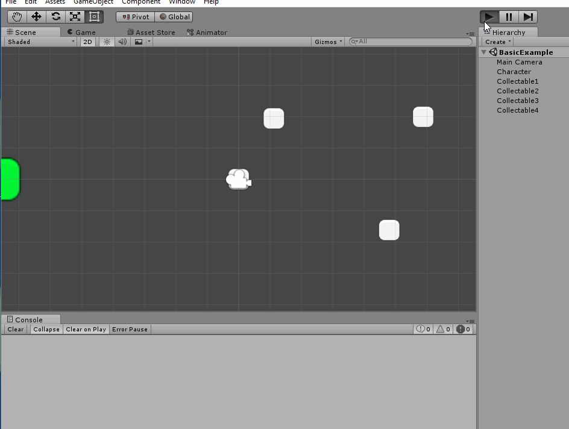

# unity-2dcollectables

Simple collectables and collectors for 2d unity games

## How

+ Add [2DCollectables](,/Assets/2DCollectables) to your unity project
+ Add `Collider2D` components (of any shape) to your collectable objects
+ Add `Collectable` scripts to your collectable objects
+ Add a [Collector](./Assets/2DCollectables/Scripts/Collectors) to your character (collector) or implement your own by deriving from `ICollector`
+ Done

## Examples

These live under [Examples](,/Assets/2DCollectables/Examples)

### Basic

> Note: object `Collectable1` and `Collectable2` are static 2d colliders, while `Collectable3` and `Collectable4` are 2d trigger colliders. Both work great.

A simple collector demo in which a character (controlled with `WASD`) moves around and collects shapes. On collection, the object name is written to the console, and it is promptly destroyed. 

### Stack

A simple collector demo in which a character (controlled with `WASD`) moves around and collects shapes until a max of `5` have been collected. The character can consume shapes (from most recent to least recent pickup) by pressing `SPACE` - at which point the object name is written to the console, and it is promptly destroyed.

## License

MIT